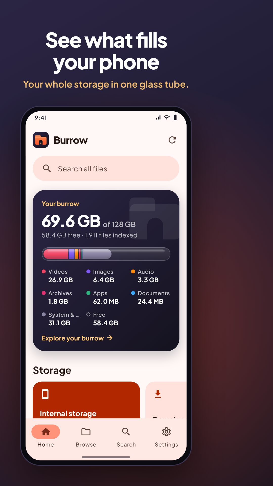
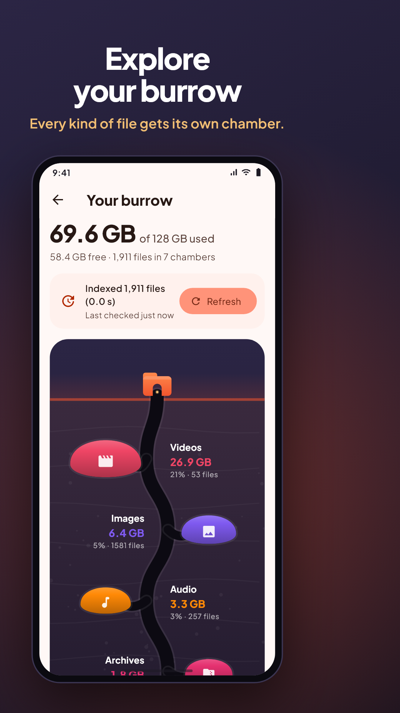
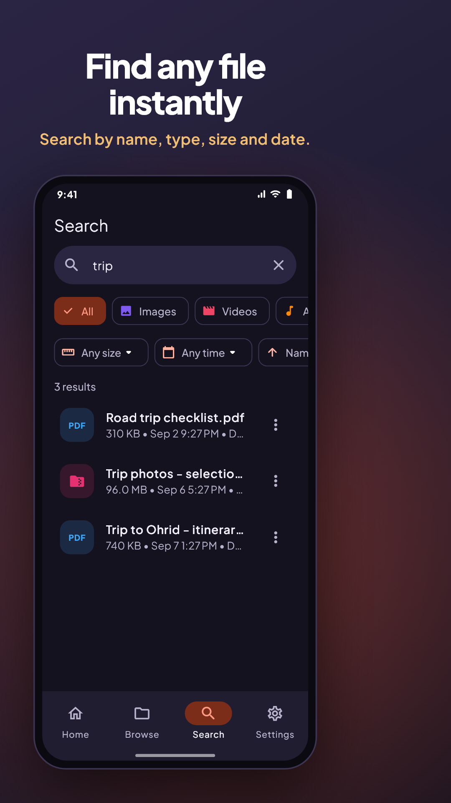
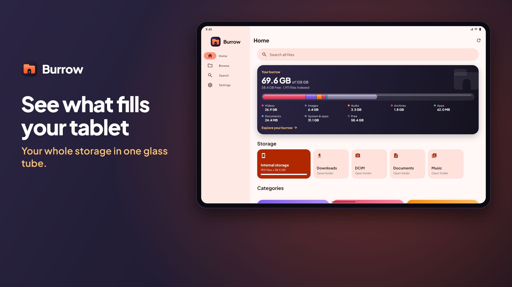

# Burrow

**Every file, right where you left it.** Burrow is a file manager for **Android, iOS and the web**, with a responsive layout for phones, tablets and desktops.

<p>
  
  
  
</p>


## Brand

| | |
| --- | --- |
| Name | **Burrow**, set in `lib/core/brand.dart` |
| Mark | A folder with an arched doorway and a warm glow, drawn in code by `BurrowMarkPainter` (`lib/ui/widgets/brand_logo.dart`) |
| Colors | Ember `#F2542D` (accent), Ink `#15121F` (icon, splash, dark surfaces), Glow `#FFC978` |
| Type | Plus Jakarta Sans, bundled in `assets/fonts` (SIL OFL) |

Every launcher icon, splash image and favicon is rendered from the same painter:

```bash
flutter test tool/generate_icons_test.dart   # Android (adaptive + themed), iOS, web
python tool/flatten_ios_icons.py             # App Store icons must be opaque (needs Pillow)
flutter test tool/store_screens_test.dart    # every store screenshot + feature graphic (docs/store)
```

To rename the app, change `Brand.name` and the display names in `android/app/src/main/AndroidManifest.xml` (`android:label`), `ios/Runner/Info.plist` (`CFBundleDisplayName`), `web/index.html` and `web/manifest.json`.

## Features

- **Home screen**
  - **Storage tube:** device capacity (e.g. "69.6 GB of 128 GB") as a glass tube filled with a band per kind of file, plus System & apps and free space.
  - **Your burrow:** tap the card for a cut-away of an underground burrow. Every kind of file gets a chamber sized by the space it takes; tap a chamber to see its files.
  - Search bar.
  - Storage cards: internal storage, SD cards, Downloads, DCIM and so on.
  - Gradient **category cards** that show file counts and sizes: Images, Videos, Audio, Documents, Apps (APK), Archives.
  - **Recent files** list: shows **Newest**, **Oldest** or **Largest** first, has type filters, a refresh button and pull-to-refresh.
- **Browse**
  - Breadcrumb navigation.
  - List or grid view.
  - Search inside the current folder.
  - Category filter chips.
  - Sort by **name, date, size or type**, in either direction.
  - Long-press to multi-select, then copy, move or delete.
  - New folder, rename, details, and a "show hidden files" toggle.
- **Search:** searches every indexed file by name. You can filter by type, **size** (<1 MB, 1–100 MB, >100 MB) and **date** (today, 7 days, 30 days, a year), and sort by name, date or size.
- **Open everything**
  - **PDF:** built-in viewer (pdfium through `pdfrx`) with zoom, page navigation and password-protected PDFs.
  - **Images:** zoomable gallery. Swipe between images; double-tap to zoom.
  - **Text, code, JSON, CSV, Markdown and logs:** text viewer that pretty-prints JSON, has a word-wrap toggle and adjustable font size.
  - **Archives:** lists the contents of zip, jar, tar, tar.gz/tgz, tar.bz2, tar.xz, gz, bz2 and xz files, and **extracts** them. Entries whose paths would land outside the target folder ("zip slip") are refused.
  - **APK:** tap to **install** on Android. The system installer opens; the first time, Android asks you to allow installs from this app.
  - **Video** (mp4, m4v, mov, webm, mkv, 3gp): built-in player with seek, playback speed and fullscreen (`video_player` + `chewie`).
  - **Audio** (mp3, m4a, aac, wav, flac, ogg, opus): built-in player with a spinning disc, seek, ±10 s, previous/next through the folder, auto-advance, and it keeps playing with the screen off.
  - **Everything else** (AVI, WMV, Office files and so on), or a video/audio file the device can't decode: opens in the matching installed app. On the web it opens in a new browser tab.
- **Settings:** light, dark or system theme; accent color; grid view; hidden files; rescan storage.

## Platform notes

| Platform | Storage |
| --- | --- |
| Android | Whole shared storage (`/storage/emulated/0`) plus SD cards. Android 11+ asks for **All files access**; Android 10 and older use the storage permission. |
| iOS | The app's Documents folder, which also appears in the Files app ("On My iPhone → Burrow"). Use **Import** to copy files in. |
| Web | Browsers don't let web pages read your device's folders, so the web app works on files you **Import**. They live in memory for the current tab. A few sample files (PDF, zip, image, text) are included so you can try every viewer. |

The Android manifest declares `MANAGE_EXTERNAL_STORAGE` and `REQUEST_INSTALL_PACKAGES`. Google Play only allows these for apps whose core purpose needs them (file managers qualify), and you have to fill in the permission declaration form in the Play Console.

## Run

```bash
flutter pub get
flutter run                 # a connected Android / iOS device
flutter run -d chrome       # web
```

## Build

```bash
flutter build appbundle --release                    # Google Play
flutter build apk --release                          # sideloading
flutter build ipa --release                          # App Store
flutter build web --release --no-web-resources-cdn   # self-contained, works offline
```

## Release checklist

1. **Android signing.** Create an upload key once and keep it safe; losing it means you can't update the app:
   ```bash
   keytool -genkey -v -keystore ~/upload-keystore.jks -keyalg RSA -keysize 2048 -validity 10000 -alias upload
   ```
   Then create `android/key.properties` (it's gitignored, never commit it):
   ```properties
   storeFile=/absolute/path/to/upload-keystore.jks
   storePassword=...
   keyAlias=upload
   keyPassword=...
   ```
   Without this file, release builds are signed with the debug key and print a warning. Play Console rejects them.
2. **Version.** Bump `version:` in `pubspec.yaml` (`1.2.0+5` means versionName 1.2.0, build 5) for every store upload.
3. **Application ID.** `com.BoriSoft.burrow` (Android, registered in Play Console) / `com.theforis.fileManager` (iOS). It can't be changed after the first store release.
4. **Play Console.** Fill in the permissions declaration for `MANAGE_EXTERNAL_STORAGE` and `REQUEST_INSTALL_PACKAGES` (file managers qualify), and add a privacy policy URL. Burrow collects no data, so the Data safety form is "no data collected".
5. **iOS.** Set your team under *Signing & Capabilities* in Xcode, then `flutter build ipa`.
6. **Naming.** The name under the icon stays **Burrow** (launchers cut longer labels off). The store listing title is **Burrow: File Manager**, so people searching for "file manager" find it (30-character limit on both stores). On the App Store you can instead use the name "Burrow" with the subtitle "File Manager".
7. **Trademark.** Check that "Burrow" is free to use for software in the countries you ship to before you publish.

## Test

```bash
flutter analyze
flutter test
```

## Store assets (`docs/store`)

| Folder | Size | Play Console slot |
| --- | --- | --- |
| `phone/` | 1080×1920 | Phone screenshots |
| `tablet-7/` | 1920×1080 | 7-inch tablet (shown on an unfolded foldable) |
| `tablet-10/` | 2560×1440 | 10-inch tablet |
| `chromebook/` | 1920×1080 | Chromebook |
| `raw/` | device resolution | Unframed captures (phone, foldable, 7" and 10" tablet, desktop/web) |
| `feature-graphic.png`, `icon-512.png` | 1024×500, 512×512 | Feature graphic, app icon |

The screenshots show the real app running on generated demo data (`tool/showcase_backend.dart`).

## Project layout

```
lib/
  core/           brand, models: FileEntry, FileCategory, sorting/filtering, formatting
  services/
    storage/      StorageBackend interface
                  io_backend.dart      real file system (Android/iOS)
                  memory_backend.dart  in-memory file system (web)
                  archive_utils.dart   archive decoding + zip-slip protection
    opener/       hand files to other apps / the browser, APK install
  state/          FileIndex (storage scan, categories, recent files), settings
  ui/             shell (responsive navigation), home, burrow, browser, search,
                  category, settings, viewers (PDF, image, text, archive)
tool/             icon + store screenshot generators (showcase_backend.dart = demo phone data)
```
