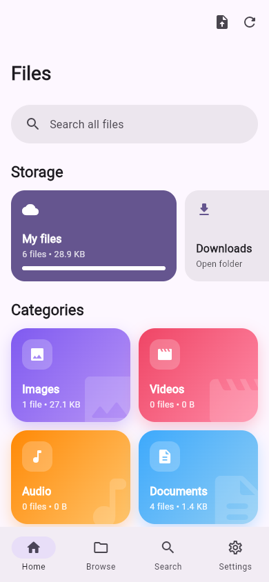
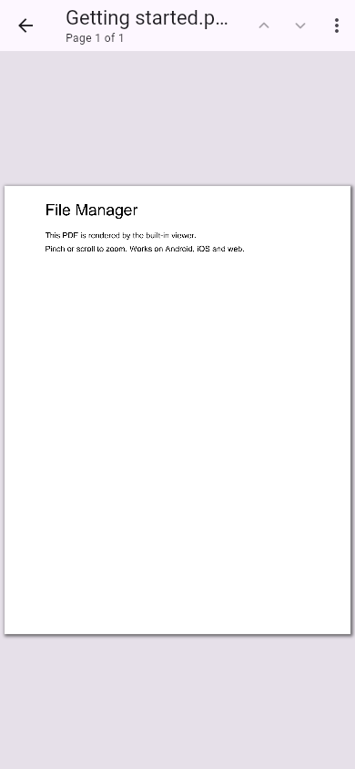
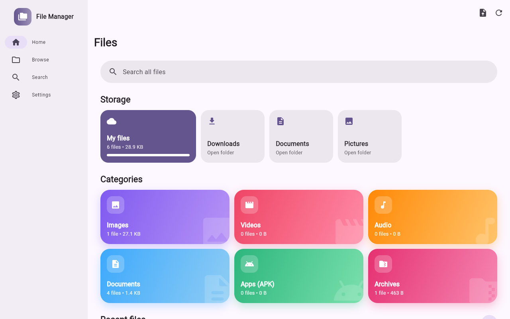
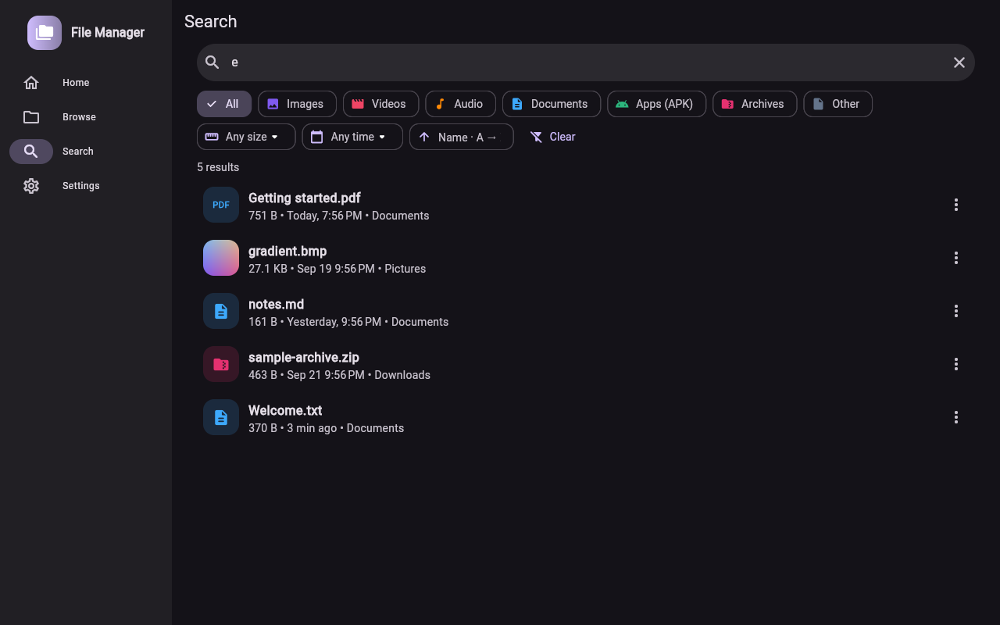

# File Manager

A Flutter file manager for **Android, iOS and the web**, with a responsive layout for phones, tablets and desktops.

<p>
  
  
</p>



## Features

- **Home screen**
  - Search bar.
  - Storage cards: internal storage, SD cards, Downloads, DCIM and so on.
  - Gradient **category cards** that show file counts and sizes: Images, Videos, Audio, Documents, Apps (APK), Archives.
  - **Recent files** list: shows **Newest**, **Oldest** or **Largest** first, has type filters, a refresh button and pull-to-refresh.
- **Browse**
  - Breadcrumb navigation.
  - List or grid view.
  - Search inside the current folder.
  - Category filter chips.
  - Sort by **name, date, size or type**, in either direction.
  - Long-press to multi-select, then copy, move or delete.
  - New folder, rename, details, and a "show hidden files" toggle.
- **Search:** searches every indexed file by name. You can filter by type, **size** (<1 MB, 1–100 MB, >100 MB) and **date** (today, 7 days, 30 days, a year), and sort by name, date or size.
- **Open everything**
  - **PDF:** built-in viewer (pdfium through `pdfrx`) with zoom, page navigation and password-protected PDFs.
  - **Images:** zoomable gallery. Swipe between images; double-tap to zoom.
  - **Text, code, JSON, CSV, Markdown and logs:** text viewer that pretty-prints JSON, has a word-wrap toggle and adjustable font size.
  - **Archives:** lists the contents of zip, jar, tar, tar.gz/tgz, tar.bz2, tar.xz, gz, bz2 and xz files, and **extracts** them. Entries whose paths would land outside the target folder ("zip slip") are refused.
  - **APK:** tap to **install** on Android. The system installer opens; the first time, Android asks you to allow installs from this app.
  - **Everything else** (video, audio, Office files and so on): opens in the matching installed app. On the web it opens in a new browser tab.
- **Settings:** light, dark or system theme; accent color; grid view; hidden files; rescan storage.

## Platform notes

| Platform | Storage |
| --- | --- |
| Android | Whole shared storage (`/storage/emulated/0`) plus SD cards. Android 11+ asks for **All files access**; Android 10 and older use the storage permission. |
| iOS | The app's Documents folder, which also appears in the Files app ("On My iPhone → File Manager"). Use **Import** to copy files in. |
| Web | Browsers don't let web pages read your device's folders, so the web app works on files you **Import**. They live in memory for the current tab. A few sample files (PDF, zip, image, text) are included so you can try every viewer. |

The Android manifest declares `MANAGE_EXTERNAL_STORAGE` and `REQUEST_INSTALL_PACKAGES`. Google Play only allows these for apps whose core purpose needs them (file managers qualify), and you have to fill in the permission declaration form in the Play Console.

## Run

```bash
flutter pub get
flutter run                 # a connected Android / iOS device
flutter run -d chrome       # web
```

## Build

```bash
flutter build apk --release
flutter build ipa --release
flutter build web --release --no-web-resources-cdn   # self-contained, works offline
```

## Test

```bash
flutter analyze
flutter test
```

## Project layout

```
lib/
  core/           models: FileEntry, FileCategory, sorting/filtering, formatting
  services/
    storage/      StorageBackend interface
                  io_backend.dart      real file system (Android/iOS)
                  memory_backend.dart  in-memory file system (web)
                  archive_utils.dart   archive decoding + zip-slip protection
    opener/       hand files to other apps / the browser, APK install
  state/          FileIndex (storage scan, categories, recent files), settings
  ui/             shell (responsive navigation), home, browser, search,
                  category, settings, viewers (PDF, image, text, archive)
```
